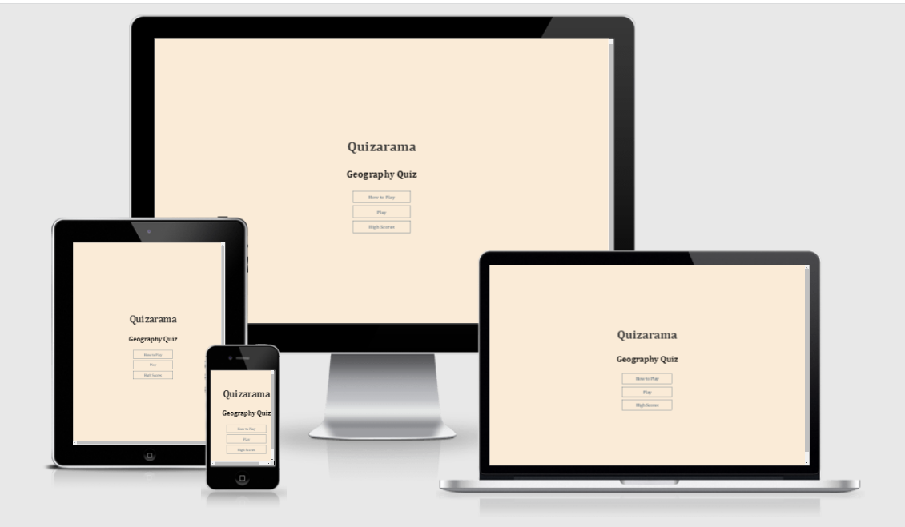
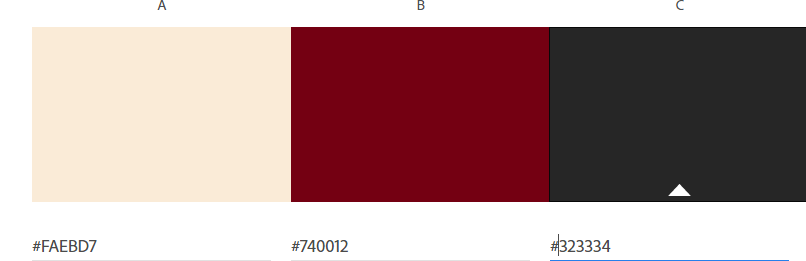
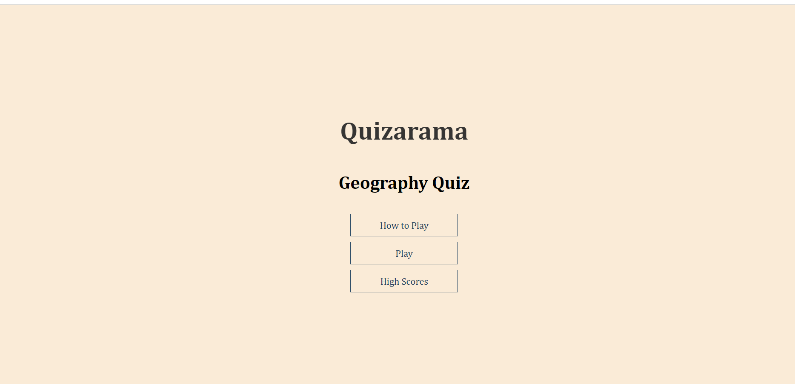
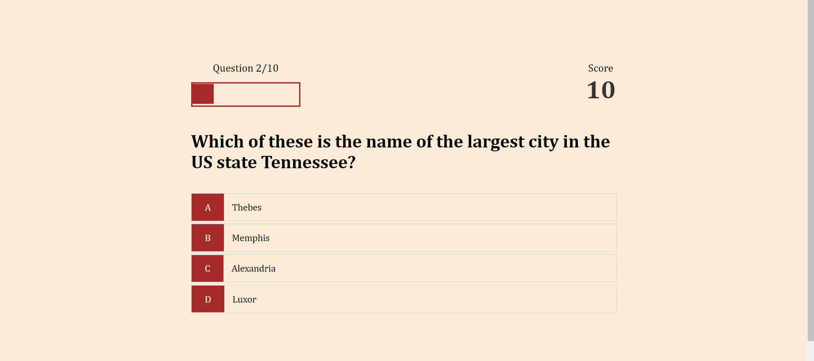
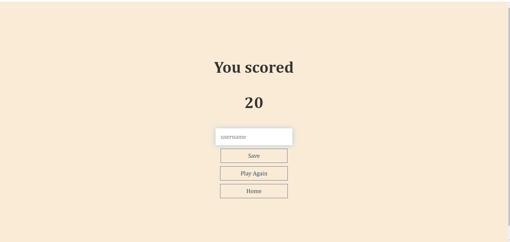
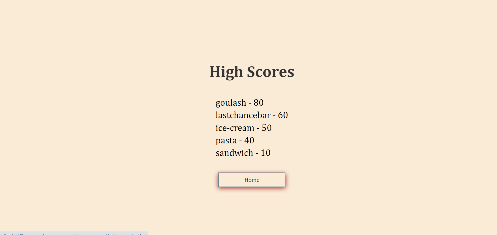
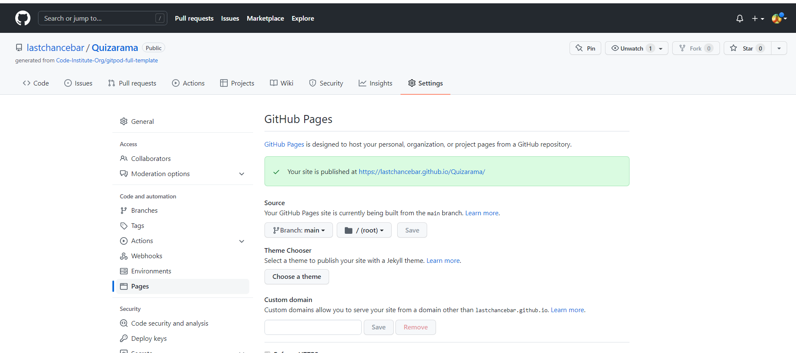
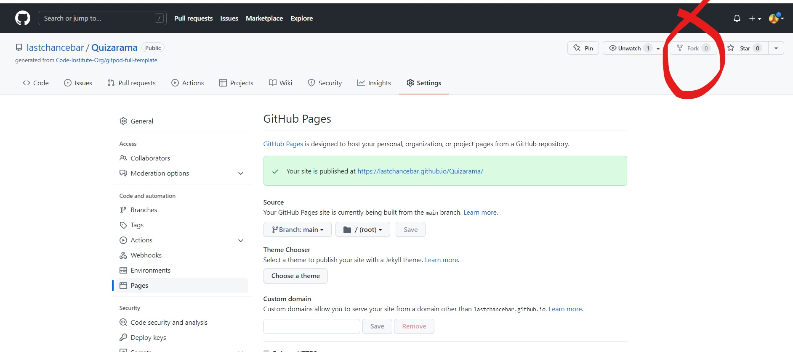
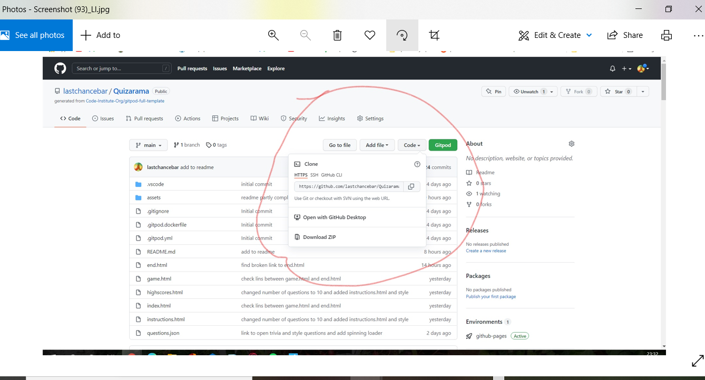

# **_Quizarama - the Geography Quiz_**

Quizarama is a multiple choice geography quiz. The site is targeted at students and quiz fans and is intended to keep the user interested and challenged with the breadth of questions which are challenging but not too difficult so as to keep the end user interested in completleing the challenge and replaying the game.

Welcome to <a href="https://lastchancebar.github.io/Quizarama/index.html" target="blank" rel="noopener">Quizarama - the Geography Quiz</a>

# Contents

* [ **User Experience UX**](<#user-experience-ux>)
    * [User stories](#<user-stories>)
    * [Wireframes](<#wireframes>)
    * [Site Structure](<#site-structure>)
    * [Design Choices](<#design-choices>)
    * [Typography](<#typography>)
    * [Colour Scheme](<#colour-scheme>)
* [**Features**](<#features>)
  * [**Home**](<#home>)
    * [Instructions](<#instructions.html>)
    * [Play](<#game.html>)
    * [Username](<#end.html>)
    * [Save scores](<#end.html>)
   * [**Game**](<#game.html>) 
    
  * [**Name and save score**](<#end.html>) 
    
  * [**High Scores**](<#highscores.html>) 
   

* [**Technologies Used**](<#technologies-used>)
* [**Testing**](<#testing>)
* [**Deployment**](<#deployment>)
* [**Credits**](<#credits>)
    * [Content](<#content>)
    * [Media](<#media>)
  
* [**Acknowledgments**](<#acknowledgments>) 

# User Experience (UX)

## User Stories
* As a user I want to navigate through the site smoothly.
* As a user I wnat the site to load quickly.
* As a user I want to see instructions as to how to play the quiz.
* As a user I want challenging questions.
* As a user I want to see the progress of the quiz via a progress bar and to see my score.
* As a user I want to be able to attach my name to my score.
* As I user I want to see the high scores.
* As a user I want to be able to play the quiz again easily.
  
  [back to top](<#contents>)

  ## Wireframes

  I did not use wireframes to plan this project.

  ## Site Structure
  
  Quizarama has 5 HTML pages. The [home page](index.html) is the default loading page, [instructions page](instructions.html), 
  [game page](game.html), [username and save score page](end.html) and [high scores page](highscores.html). The instructions, 
  game and high scores pages are accessible from the home page via button. The end page loads after the game is played.

  [back to top](<#contents>)
  ## Design Choices
    *   ### Typography
*  The fonts chosen were Cambria, Cochin, Georgia, Times, 'Times New Roman', serif from the suggesting listing provided by Github. I tried Patrick Hand and Montserrat fonts from google fonts but settled on the fonts chosen as they were clear and familiar to the end-user and gave the quiz gravitas. They aslo provide lots of fall-back if a browser has difficult recognising the first font presented.
 * * ### Colour Scheme
    I based my colour scheme on the following image of an ancient atlas found on unsplash 
    . I did not uses this image as a background image as it slowed the loading 
    of the website down where I was in danger of losing the user's attention. 
    I used antique white and brown throughout with a very dark grey/ black for text. 
    
   
    [back to top](<#contents>)

    # Features
    Quizarama is set up to be fun challenging and easy to use. It is a typical multiple choice quiz with interactive features 
    such as save scores and high scores. The idea is to encourage the user to play and replay the game and aim to increase 
    their scores.

    ## Existing Features
    * ### Home page
  This is the default loading page and contains the name of the quiz the subject, and links to instructions, the game and high 
  scores. The buttons are prominent and clearly labelled and invite the user into the game. 
  

      [back to top](<#contents>)

      * ### Game Page
    * 
    *  The top left hand feature is a progress bar which tells the user the number of the question between 1-10 that they are
   attempting.
   * Top right hand feature is a score which increases by 10 points each time the user answers a question correcty. There is
   no penalty for answering a question incorrectly.
  * The middle of the page contains the geography question (taken from an API called Open Trivia Database) and the four multiple choice answers - one correct and three incorrect.
If the user selects a correct answer , the answer box colour background changes to  bright green and if incorrect, the answer
  *  box changes to bright red. Green for correct and red for incorrect is easily understood by the user.
  *  The game page automatically goes to the [ enter name and save score page](end.html) when the user has answered 10 questions.
  
      [back to top](<#contents>)

      * ### Name and save score page
  
  * Once the user has completed the 10 questions this page automatically loads with the users score.
  * The user is invited to enter their name and save their score.
  * The user is invited to play the game again or go back to the home page.
  * The home page contains a button for high scores which the user may check to see if they are among the top five high scorers.
  
  
      [back to top](<#contents>)
  * ### High Scores Page
  
  This page is accessed by clicking the high scores button situated in the [home page](index.html). The page keeps a list of the
   names input and matching scores of the top five scorers only.
  There is a home button under the list when the user wishes to navigate away from the page.

  [back to top](<#contents>)

  *  ## Future Features
      * Add more  levels of difficulty 
      * Add other categories
      * Store high scores and names in a secure storage database.
  
  # Technologies Used
  * [HTML5](https:..html.spec.whatwg.org/) - prvies the content nad structure for the website.
  * [CSS](https://www.w3.org/Style/CSS/Overview.en.html) - provides the styling. 
  * [JS](https://www.javascript.com/about) - to manipulate the HTML pages to make the quiz interactive.
  * [Github](https://github.com/) - used to host and edit the website.
  *  [gitpod](https://www.gitposd.io/#get-started) - used to deploy the website.
  *  [Google Local Storage](https://developer.chrome.com/docs/devtools/storage/localstorage/) - for storing high scores and users. It is not secure but perfect for this project!

  [back to top](<#contents>) 
  # Testing
Click [here](testing.md) for information on testing of Quizarama.
  

  # Deployment
### **To deploy the project**
The site was deployed to GitHub pages. The steps to deploy a site are as follows:

1. In the GitHub repository, navigate to the **Settings** tab.

2. Once in Settings, navigate to the **Pages** tab on the left hand side.

3. Under Source, select the branch to **master**, then click **save**.

Once the master branch has been selected, the page will be automatically refreshed with a detailed ribbon display to indicate the successful deployment.

  The live link to the Github repository can be found here -  https://github.com/lastchancebar/quizarama

### **To fork the repository on GitHub**

A copy of the GitHub Repository can be made by forking the GitHub account. This copy can be viewed and changes can be made to the copy without affecting the original repository. Take the following steps to fork the repository;

1. Log in to **GitHub** and locate the [repository](https://github.com/lastchancebar/quizarama).
2. On the right hand side of the page inline with the repository name is a button called **'Fork'**. Click on the button to create a copy of the original repository in your GitHub Account.

### **To create a local clone of this project**

The method from cloning a project from GitHub is below:

1. Under the repository’s name, click on the **code** tab. 
2. In the **Clone with HTTPS** section, click on the clipboard icon to copy the given URL.

3. In your IDE of choice, open **Git Bash**.

4. Change the current working directory to the location where you want the cloned directory to be made.

5. Type **git clone**, and then paste the URL copied from GitHub.

6. Press **enter** and the local clone will be created.

 [back to top](<#contents>) 
  
  # Credits

### Contents
* The fonts came from Github.
* 
  
* I used a youtube tutorial by James Quick to learn how to code the following 
  *   a progress bar
  *   a spinning loader
  *   a high scores list with only 5 entries.
  

  
*  The read me format was inspired by a Project  [Wawa Woods](https://lastchancebar-wawaswoods-3jkv8uef12f.ws-eu30.gitpod.io/) by Ewan Colquhoun which I forked with thanks.
 

### Media

* The quiz questions came from a API [Open Trivia DataBase](https://opentdb.com).

# Acknowledgements

The site was completed as a Portfolio 2 Project piece for the Full Stack Software Developer (e-Commerce) Diploma at the Code Institute. As such I would like to thank my mentor Precious Ijege, the Slack community, especially Dave Horrocks and Rachel Rock, and all at the Code Institute for their help and support, especially Kasia, my course administrator. 

Finally, I would like to acknowledge the class of strong and supportive women I am lucky to be part of and Mayo Sligo Leitrim ETB for giving us the opportunity to acquire the valuable skills with which I know we will go forth and conquer the world (of computing!!)

Darina Kelly 2022.