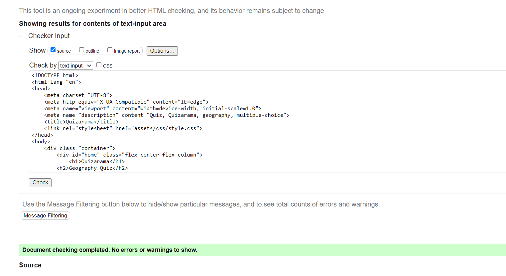
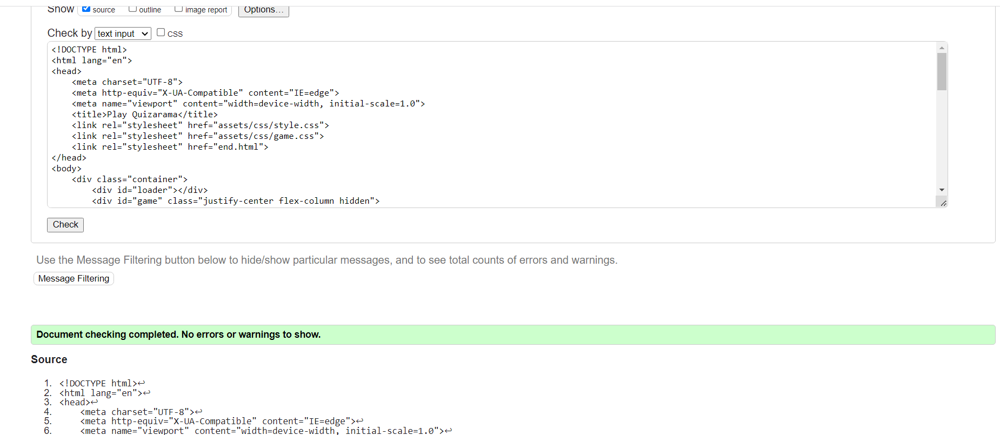
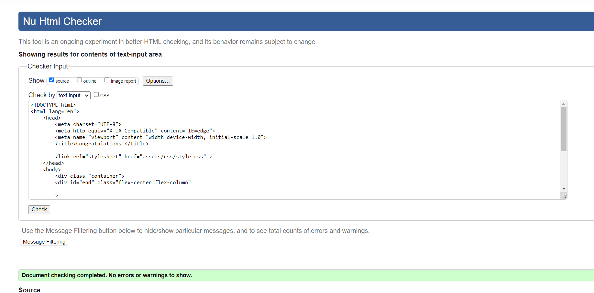
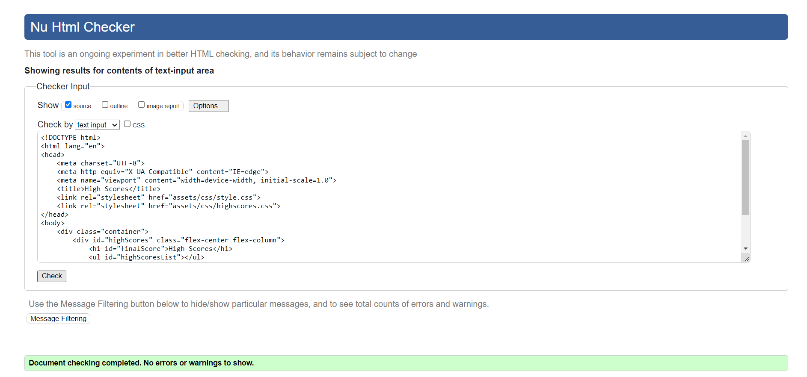
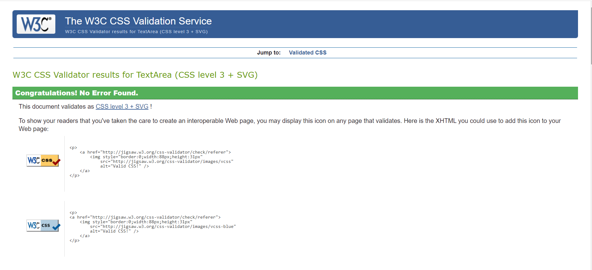
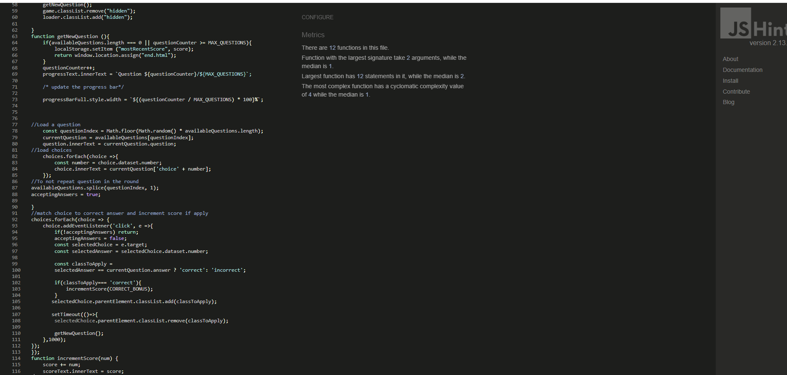
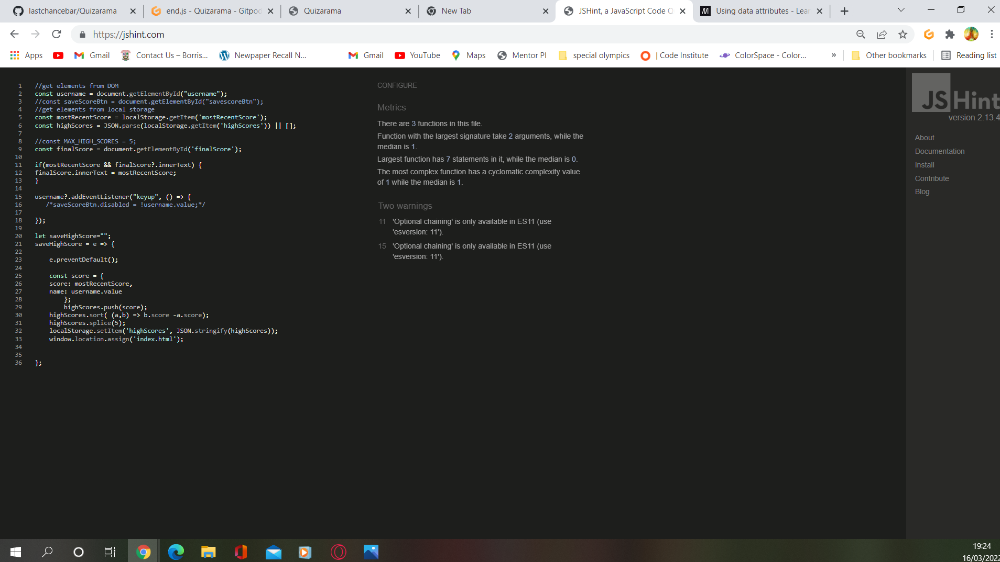
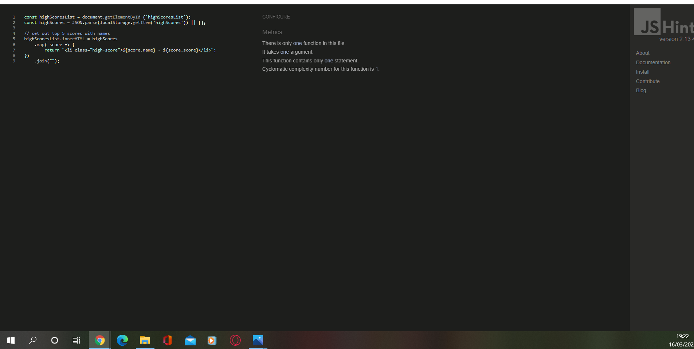
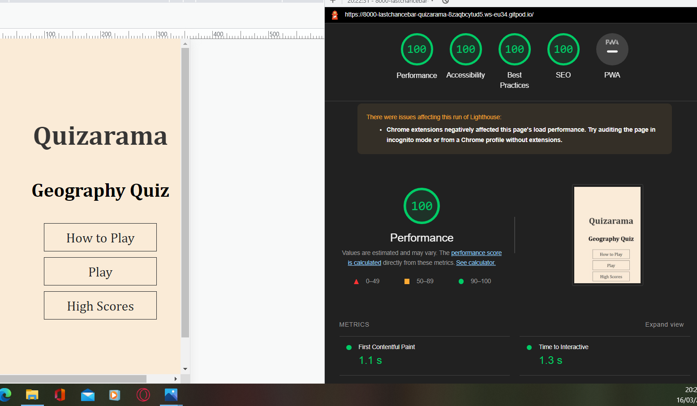

# Testing of Quizarama
## Code Validation
The Quizarama site has been thoroughly tested. All the code has been run though the [W3C HTML Validator](http://validator.w3.org/), the  [W3C CSS Vaidator](https://jigsaw.w3.org/css-validator/) and the [JavaScript validator](https://jshint.com/). Minor error were found on the game and end pages. After a fix and retest no errors were  returned.
 The HTML validator results for each page are below:
* Home page
  
  

* Game page
  
  

* Enter name and Save score page
  
  

* High score page
  
  

The CSS Validator results are below:

  
  
  The JavaScript validator results are below:
  

  

  

  ## Responsiveness 

  * The responsive design tests were carried out manually with [Google Chrome DevTools](https://developer.chrome.com/docs/devtools/) and [Responsive Design Checker](https://www.responsivedesignchecker.com/).

  |        | Moto G4 | Galaxy S5 | iPhone 5 | iPad | iPad Pro | Display <1200px | Display >1200px |
|--------|---------|-----------|----------|------|----------|-----------------|-----------------|
| Render | pass    | pass      | pass     | pass | pass     | pass            | pass            |
| Images | pass    | pass      | pass     | pass | pass     | pass            | pass            |
| Links  | pass    | pass      | pass     | pass | pass     | pass            | pass            |
## Browser Compatibilty

Quizarama was tested on the following browsers with no issues for the user- 
Goodle Chrom, Microsoft Edge, safari and Mozilla Firefoc. Appearance , functionality and responsivemness were consistnet throughout or a range of device sizes and browsers.

## Lighthouse performance 

## Known Bugs
* ### Resolved
  * When the site was first deployed an error 404 page came up where the name and save scores page was supposed to load. My mentor advised about the possibility of requesting information from an API could throw up a 404 erorr. However, this was not the case.
  The error was fixed by going back through all the page links and removing a backslash from the script link at the bottom of game.html.
  * The HTML validator showed empty heading tags in the index page and high scroes page. This information was supplied by the Js files. I added a 0 in both cased and the error was fixed.

* ### Unresolved
  * The questions from open Trivia Database have not translated properly over showing up combinations of symbols instead of apostrophes. 
  * There are two ES11 warnings on End.js . This syntax was used as a timely fix to a persistent console error. 

 Back to [README.md](./README.md#testing). 